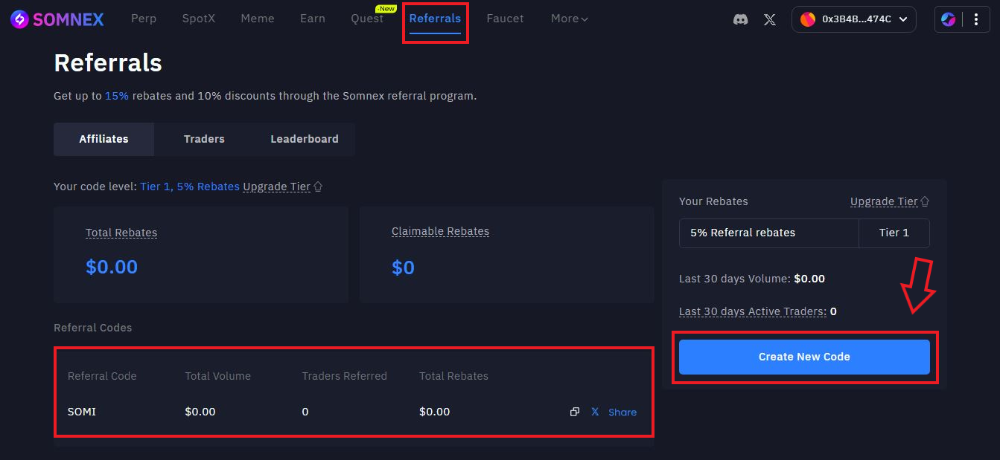
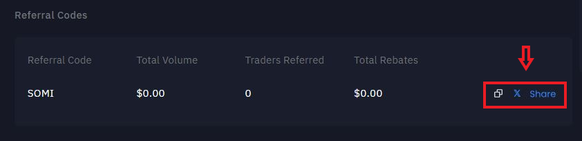

# Referrals & Rebates

Earn fee rebates and give your invitees trading discounts with Somnex’s tiered referral program. Create your unique code on the Affiliates/Referrals tab and share it with new users.

### Program Tiers (Mainnet)

* Tier 1 (Starter): Invitee gets 5% trading fee discount; you get 5% rebate.
* Tier 2 (Growth): Refer 10 active traders with $2M+ combined volume → both get 10% discount/rebate.
* Tier 3 (Elite): Refer 15 active traders with $8M+ combined volume → you get 15% rebate; invitee keeps 10% discount.

### How It Works

1. Go to Somnex → Referrals/Affiliates and generate your unique code.
2. Share the code with traders.
3. As they trade, they receive the discount and you accumulate rebates according to your current tier.
4. Track progress (active traders, total referred volume, tier status) on the Referrals dashboard.

<figure><figcaption></figcaption></figure>

### Example

If you’re on Tier 2, your invitee pays 10% less trading fees on eligible trades, and you receive a 10% rebate of those eligible fees as the referrer.

### Terms & Notes

* Eligibility and exact fee base are subject to product configuration (spot/perps, maker/taker if applicable).
* Abuse (self-referrals, wash trading) may lead to disqualification.
* Rebates/discounts may be updated; always check the Referrals page for live terms.

### Where to Find Your Code

1. Open Somnex and connect your wallet.
2. Navigate to Referrals then choose Affiliates.
3. Copy your code or share it on X/Twitter.

<figure><figcaption></figcaption></figure>
