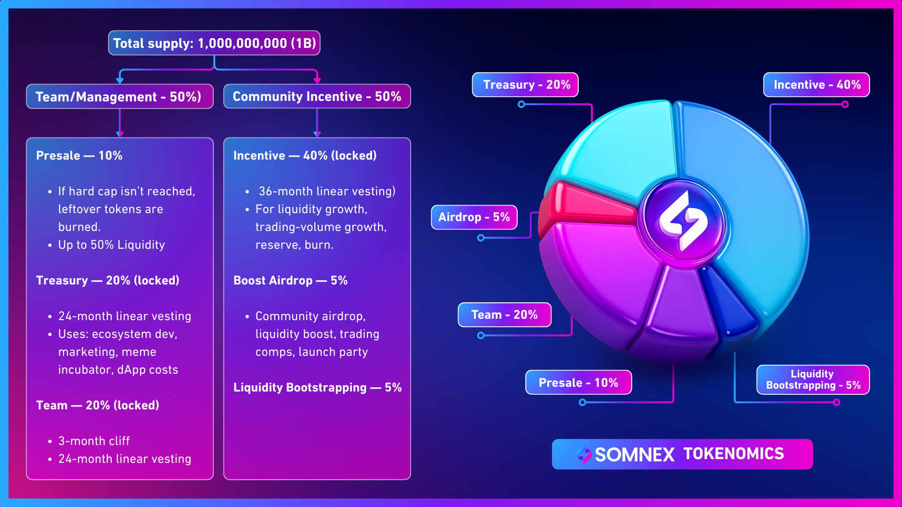

# Tokenomics

Total supply: 1,000,000,000 (1B).

#### Distribution

| Category                | Share | Vesting / Notes                                                                 |
| ----------------------- | ----- | ------------------------------------------------------------------------------- |
| Team                    | 20%   | Locked; 3-month cliff, 24-month linear vesting                                  |
| Treasury                | 20%   | Locked; 24-month linear; ecosystem dev, marketing, meme incubator, dApp costs   |
| Presale                 | 10%   | Leftovers burned if hard cap not reached; 'up to 50% Liquidity' — specifics TBD |
| Incentive               | 40%   | Locked; 36-month linear; for liquidity/trading growth, reserve, burn            |
| Boost Airdrop           | 5%    | Community airdrop, trading comps, launch events                                 |
| Liquidity Bootstrapping | 5%    | Early liquidity provisioning                                                    |

_Somnex Tokenomics_

