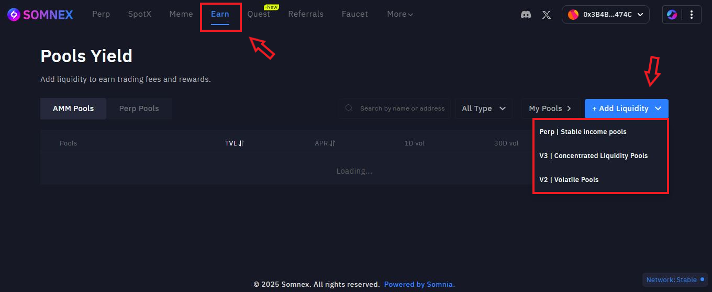
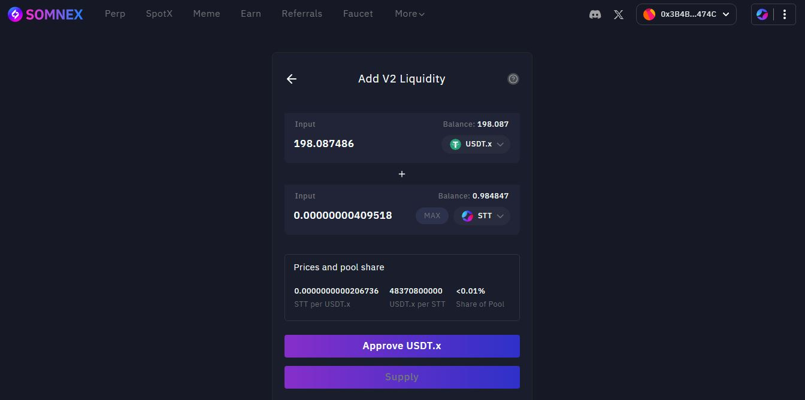

# Liquidity Pools

### Liquidity architecture

* Aggregator routing taps Somnex V2/V3, QuickSwap, Somnia Exchange, and others for best execution.
* AMM liquidity via V2 (full-range) and V3 (concentrated ranges).
* Perp liquidity (SPLP) is single-sided USDC; utilization drives borrow fees.

### Add Liquidity

Add liquidity through Earn → + Add Liquidity and choose a strategy.

<figure><figcaption></figcaption></figure>

_Strategy picker_

### 1️⃣ Perp | Stable income pools (SPLP)

1. Select Perp Pools and deposit USDC.
2. Review projected APR (driven by trading fees).
3. Approve and Confirm.
4. Monitor utilization and APR; withdraw anytime per pool rules.

`Perp Pools – Low risk, auto-compounding passive yield via stablecoins:`&#x20;

* Designed for low-risk, USDC in / USDC out &#x20;
* Single-sided deposit. no pairs &#x20;
* No Locks, deposit & withdraw any time &#x20;
* Real-time yield distribution — no claims, no extra fees &#x20;
* Rewards come directly from perpetual trading fees &#x20;

💡 Ideal for users seeking passive income without worrying about impermanent loss.

<figure><figcaption></figcaption></figure>

### 2️⃣ V3 | Concentrated Liquidity Pools

1. Choose pair & fee tier, then set a price range.
2. Add token amounts; ensure both sides match required ratio.
3. Approve and Confirm.
4. Re-range as needed to keep liquidity active.

`V3 Pools – Concentrated Liquidity, Enhanced Capital Efficiency`

* V3 Pools allow LPs to deploy liquidity within custom price ranges, optimizing fee capture relative to price movement.&#x20;
* Selectable fee tiers (0.05%–1%) depending on pair volatility &#x20;
* Custom price range via tick-based boundaries &#x20;
* Capital-efficient LP provisioning &#x20;

💡 Ideal for advanced LPs who want to maximize returns through strategic price range selection and are comfortable actively managing positions.

<figure><figcaption></figcaption></figure>

### 3️⃣ V2 | Volatile Pools

1. Choose pair and deposit both tokens (50/50 by value unless specified).
2. Approve and Confirm.
3. Earn swap fees continuous

`V2 Pools – Classic, Volatile Exposure` &#x20;

* Traditional AMM pool across Memes and native Somnia tokens &#x20;
* Yield potential increases with volatility &#x20;
* Easy to manage — no need to set custom ranges &#x20;

💡 Best for users comfortable with market risk and aiming for long-term gains.

<figure><figcaption></figcaption></figure>
