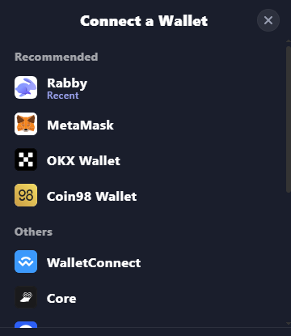

# Perp Trade

### Perp Trade

Trade perpetual futures on Somnex with up to 50× leverage across 50+ markets. Go long or short without owning the underlying asset, using market/limit/trigger orders and optional take‑profit/stop‑loss.

_Perp trading interface_

### Key concepts

* Collateral & leverage: your collateral (e.g., USDT) backs a larger position size via leverage.
* IMR/MMR: Initial and Maintenance Margin Requirements determine how much equity you need to open and keep positions. IMR = IMF × position notional; MMR = MMF × position notional (per‑market parameters).
* Funding rate: periodic payment between longs and shorts to anchor perp price to spot.
* Borrow fee: hourly fee for borrowed assets from the liquidity pool. Formula: (assets\_borrowed / total\_assets\_in\_pool) × 0.01% per hour.
* Mark price & oracle: the UI shows a mark price from PYTH oracle.

### Order types

* Market: immediate execution at best available price.
* Limit: execute at your chosen price or better.
* Trigger: conditional orders that place when a trigger price is hit.

### Open a position

1. Select a market (e.g., ETH‑USD), choose Long or Short.
2. Pick order type (Market/Limit/Trigger).
3. Enter order size and set leverage with the slider.
4. Optionally set Take Profit / Stop Loss.
5. Confirm the order in your wallet.

### Manage risk

* Track Equity, Margin ratio, and MMR; add collateral or reduce size if margin gets tight.
* Mind funding and borrow fees—high utilization increases borrow fee.
* Use stop losses; avoid maxing leverage in volatile markets.

### Fees

• Trading fee (fixed): small percentage on open/close.

• Funding rate (dynamic): paid between longs and shorts.

• Borrow fee (dynamic): (assets\_borrowed / total\_assets\_in\_pool) × 0.01% per hour.

### Liquidation (summary)

Positions may be liquidated when Equity ≤ MMR. See the “Liquidation” page for full details and examples.
